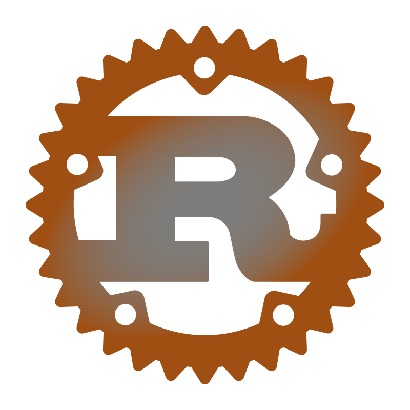

# Padrões de projeto

Alguns exemplos de padrões de projetos elaborados
para fins de estudo.

Baseado no repositorio
[algorithms-and-data-structures](https://github.com/kelvins/algorithms-and-data-structures) elaborado por [Kelvin](https://github.com/kelvins).

## Comportamental

### Strategy

O Strategy é um padrão de projeto comportamental que permite que você defina uma família de algoritmos, coloque-os em classes separadas, e faça estes objetos serem intercambiáveis
[refactoring.guru](https://refactoring.guru/pt-br/design-patterns/strategy).

Este padrão tem dois componentes principais: a interface Strategy e a classe Context. A interface Strategy declara o tipo de algoritmo, que pode ser uma classe abstrata ou uma interface.

**_Exemplo_**

Um exemplo desse padrão de projeto em java está disponível [aqui](https://github.com/andersonhsporto/design-patterns-java/tree/main/src/strategy) onde foi implementado uma strategy
para algoritmos de ordenação.

## Criacional

### Builder

O Builder é um padrão criacional muito similar ao método factory este organiza a criação
do objetos em etapas fora de sua própria classe e mova ele para objetos separados chamados builders.

**_Exemplo_**

Um exemplo desse padrão de projeto em java está disponível [aqui](https://github.com/andersonhsporto/design-patterns-java/tree/main/src/builder).

## Estrutural

### Adapter

O padrão Adapter permite que você crie uma classe de meio termo que serve como um tradutor entre seu código e a classe antiga, uma classe de terceiros, ou qualquer outra classe com uma interface estranha.

**_Exemplo_**

Um exemplo desse padrão de projeto em java está disponível [aqui](https://github.com/andersonhsporto/design-patterns-java/tree/main/src/adapter) onde neste foi implementado
um adapter para dois sistemas de coordenadas distintos.

## Tabela de conteúdos

<html>
    <table align="center">
        <tr>
            <td align="center">Padrões de Projeto Criacional</td>
            <td align="center">
                
            </td>
            <td align="center">
                
            </td>
            <td align="center">
                
            </td>
            <td align="center">
                
            </td>
            <td align="center">
                
            </td>
            <td align="center">
                
            </td>
            <td align="center">
                
            </td>
            <td align="center">
                
            </td>
            <td align="center">
                
            </td>
            <td align="center">
                
            </td>
            <td> <!-- Kotlin -->
                
            </td>
        </tr>
        <tr>
            <td><a href="https://refactoring.guru/design-patterns/factory-method">Factory</a></td>
            <td> <!-- C -->
                
            </td>
            <td> <!-- C++ -->
                
            </td>
            <td> <!-- Java -->
                
            </td>
            <td> <!-- Python -->
                
            </td>
            <td> <!-- Go -->
                
            </td>
            <td> <!-- Ruby -->
                
            </td>
            <td> <!-- JavaScript -->
                
            </td>
            <td> <!-- Swift -->
                
            </td>
            <td> <!-- Rust -->
                
            </td>
            <td> <!-- Scala -->
                
            </td>
            <td> <!-- Kotlin -->
                
            </td>
        </tr>
        <tr>
            <td><a href="https://refactoring.guru/design-patterns/builder">Abstract Factory</a></td>
            <td> <!-- C -->
                
            </td>
            <td> <!-- C++ -->
                
            </td>
            <td> <!-- Java -->
                
            </td>
            <td> <!-- Python -->
                
            </td>
            <td> <!-- Go -->
                
            </td>
            <td> <!-- Ruby -->
                
            </td>
            <td> <!-- JavaScript -->
                
            </td>
            <td> <!-- Swift -->
                
            </td>
            <td> <!-- Rust -->
                
            </td>
            <td> <!-- Scala -->
                
            </td>
            <td> <!-- Kotlin -->
                
            </td>
        </tr>
        <tr>
            <td><a href="https://refactoring.guru/design-patterns/builder">Builder</a></td>
            <td> <!-- C -->
                
            </td>
            <td> <!-- C++ -->
                
            </td>
            <td> <!-- Java -->
                
            </td>
            <td> <!-- Python -->
                
            </td>
            <td> <!-- Go -->
                
            </td>
            <td> <!-- Ruby -->
                
            </td>
            <td> <!-- JavaScript -->
                
            </td>
            <td> <!-- Swift -->
                
            </td>
            <td> <!-- Rust -->
                
            </td>
            <td> <!-- Scala -->
                
            </td>
            <td> <!-- Kotlin -->
                
            </td>
        </tr>
        <tr>
            <td><a href="https://refactoring.guru/design-patterns/prototype">Prototype</a></td>
            <td> <!-- C -->
                
            </td>
            <td> <!-- C++ -->
                
            </td>
            <td> <!-- Java -->
                
            </td>
            <td> <!-- Python -->
                
            </td>
            <td> <!-- Go -->
                
            </td>
            <td> <!-- Ruby -->
                
            </td>
            <td> <!-- JavaScript -->
                
            </td>
            <td> <!-- Swift -->
                
            </td>
            <td> <!-- Rust -->
                
            </td>
            <td> <!-- Scala -->
                
            </td>
            <td> <!-- Kotlin -->
                
            </td>
        </tr>
        <tr>
            <td><a href="https://refactoring.guru/design-patterns/singleton">Singleton</a></td>
            <td> <!-- C -->
                
            </td>
            <td> <!-- C++ -->
                
            </td>
            <td> <!-- Java -->
                
            </td>
            <td> <!-- Python -->
                
            </td>
            <td> <!-- Go -->
                
            </td>
            <td> <!-- Ruby -->
                
            </td>
            <td> <!-- JavaScript -->
                
            </td>
            <td> <!-- Swift -->
                
            </td>
            <td> <!-- Rust -->
                
            </td>
            <td> <!-- Scala -->
                
            </td>
            <td> <!-- Kotlin -->
                
            </td>
        </tr>
    </table>
    <table align="center">
        <tr>
            <td align="center">Padrões de Projeto Estrutural</td>
            <td align="center">
                
            </td>
            <td align="center">
                
            </td>
            <td align="center">
                
            </td>
            <td align="center">
                
            </td>
            <td align="center">
                
            </td>
            <td align="center">
                
            </td>
            <td align="center">
                
            </td>
            <td align="center">
                
            </td>
            <td align="center">
                
            </td>
            <td align="center">
                
            </td>
            <td> <!-- Kotlin -->
                
            </td>
        </tr>
        <tr>
            <td><a href="https://refactoring.guru/design-patterns/adapter">Adapter</a></td>
            <td> <!-- C -->
                
            </td>
            <td> <!-- C++ -->
                
            </td>
            <td> <!-- Java -->
                
            </td>
            <td> <!-- Python -->
                
            </td>
            <td> <!-- Go -->
                
            </td>
            <td> <!-- Ruby -->
                
            </td>
            <td> <!-- JavaScript -->
                
            </td>
            <td> <!-- Swift -->
                
            </td>
            <td> <!-- Rust -->
                
            </td>
            <td> <!-- Scala -->
                
            </td>
            <td> <!-- Kotlin -->
                
            </td>
        </tr>
        <tr>
            <td><a href="https://refactoring.guru/design-patterns/bridge">Bridge</a></td>
            <td> <!-- C -->
                
            </td>
            <td> <!-- C++ -->
                
            </td>
            <td> <!-- Java -->
                
            </td>
            <td> <!-- Python -->
                
            </td>
            <td> <!-- Go -->
                
            </td>
            <td> <!-- Ruby -->
                
            </td>
            <td> <!-- JavaScript -->
                
            </td>
            <td> <!-- Swift -->
                
            </td>
            <td> <!-- Rust -->
                
            </td>
            <td> <!-- Scala -->
                
            </td>
            <td> <!-- Kotlin -->
                
            </td>
        </tr>
        <tr>
            <td><a href="https://refactoring.guru/design-patterns/composite">Composite</a></td>
            <td> <!-- C -->
                
            </td>
            <td> <!-- C++ -->
                
            </td>
            <td> <!-- Java -->
                
            </td>
            <td> <!-- Python -->
                
            </td>
            <td> <!-- Go -->
                
            </td>
            <td> <!-- Ruby -->
                
            </td>
            <td> <!-- JavaScript -->
                
            </td>
            <td> <!-- Swift -->
                
            </td>
            <td> <!-- Rust -->
                
            </td>
            <td> <!-- Scala -->
                
            </td>
            <td> <!-- Kotlin -->
                
            </td>
        </tr>
        <tr>
            <td><a href="https://refactoring.guru/design-patterns/decorator">Decorator</a></td>
            <td> <!-- C -->
                
            </td>
            <td> <!-- C++ -->
                
            </td>
            <td> <!-- Java -->
                
            </td>
            <td> <!-- Python -->
                
            </td>
            <td> <!-- Go -->
                
            </td>
            <td> <!-- Ruby -->
                
            </td>
            <td> <!-- JavaScript -->
                
            </td>
            <td> <!-- Swift -->
                
            </td>
            <td> <!-- Rust -->
                
            </td>
            <td> <!-- Scala -->
                
            </td>
            <td> <!-- Kotlin -->
                
            </td>
        </tr>
        <tr>
            <td><a href="https://refactoring.guru/design-patterns/facade">Facade</a></td>
            <td> <!-- C -->
                
            </td>
            <td> <!-- C++ -->
                
            </td>
            <td> <!-- Java -->
                
            </td>
            <td> <!-- Python -->
                
            </td>
            <td> <!-- Go -->
                
            </td>
            <td> <!-- Ruby -->
                
            </td>
            <td> <!-- JavaScript -->
                
            </td>
            <td> <!-- Swift -->
                
            </td>
            <td> <!-- Rust -->
                
            </td>
            <td> <!-- Scala -->
                
            </td>
            <td> <!-- Kotlin -->
                
            </td>
        </tr>
        <tr>
            <td><a href="https://refactoring.guru/design-patterns/flyweight">Flyweight</a></td>
            <td> <!-- C -->
                
            </td>
            <td> <!-- C++ -->
                
            </td>
            <td> <!-- Java -->
                
            </td>
            <td> <!-- Python -->
                
            </td>
            <td> <!-- Go -->
                
            </td>
            <td> <!-- Ruby -->
                
            </td>
            <td> <!-- JavaScript -->
                
            </td>
            <td> <!-- Swift -->
                
            </td>
            <td> <!-- Rust -->
                
            </td>
            <td> <!-- Scala -->
                
            </td>
            <td> <!-- Kotlin -->
                
            </td>
        </tr>
        <tr>
            <td><a href="https://refactoring.guru/design-patterns/proxy">Proxy</a></td>
            <td> <!-- C -->
                
            </td>
            <td> <!-- C++ -->
                
            </td>
            <td> <!-- Java -->
                
            </td>
            <td> <!-- Python -->
                
            </td>
            <td> <!-- Go -->
                
            </td>
            <td> <!-- Ruby -->
                
            </td>
            <td> <!-- JavaScript -->
                
            </td>
            <td> <!-- Swift -->
                
            </td>
            <td> <!-- Rust -->
                
            </td>
            <td> <!-- Scala -->
                
            </td>
            <td> <!-- Kotlin -->
                
            </td>
        </tr>
    </table>
    <table align="center">
        <tr>
            <td align="center">Padrões de Projeto Comportamental</td>
            <td align="center">
                
            </td>
            <td align="center">
                
            </td>
            <td align="center">
                
            </td>
            <td align="center">
                
            </td>
            <td align="center">
                
            </td>
            <td align="center">
                
            </td>
            <td align="center">
                
            </td>
            <td align="center">
                
            </td>
            <td align="center">
                
            </td>
            <td align="center">
                
            </td>
            <td> <!-- Kotlin -->
                
            </td>
        </tr>
        <tr>
            <td><a href="https://refactoring.guru/design-patterns/chain-of-responsibility">Chain of Responsibility</a></td>
            <td> <!-- C -->
                
            </td>
            <td> <!-- C++ -->
                
            </td>
            <td> <!-- Java -->
                
            </td>
            <td> <!-- Python -->
                
            </td>
            <td> <!-- Go -->
                
            </td>
            <td> <!-- Ruby -->
                
            </td>
            <td> <!-- JavaScript -->
                
            </td>
            <td> <!-- Swift -->
                
            </td>
            <td> <!-- Rust -->
                
            </td>
            <td> <!-- Scala -->
                
            </td>
            <td> <!-- Kotlin -->
                
            </td>
        </tr>
        <tr>
            <td><a href="https://refactoring.guru/design-patterns/command">Command</a></td>
            <td> <!-- C -->
                
            </td>
            <td> <!-- C++ -->
                
            </td>
            <td> <!-- Java -->
                
            </td>
            <td> <!-- Python -->
                
            </td>
            <td> <!-- Go -->
                
            </td>
            <td> <!-- Ruby -->
                
            </td>
            <td> <!-- JavaScript -->
                
            </td>
            <td> <!-- Swift -->
                
            </td>
            <td> <!-- Rust -->
                
            </td>
            <td> <!-- Scala -->
                
            </td>
            <td> <!-- Kotlin -->
                
            </td>
        </tr>
		<tr>
            <td><a href="https://refactoring.guru/design-patterns/iterator">Iterator</a></td>
            <td> <!-- C -->
                
            </td>
            <td> <!-- C++ -->
                
            </td>
            <td> <!-- Java -->
                
            </td>
            <td> <!-- Python -->
                
            </td>
            <td> <!-- Go -->
                
            </td>
            <td> <!-- Ruby -->
                
            </td>
            <td> <!-- JavaScript -->
                
            </td>
            <td> <!-- Swift -->
                
            </td>
            <td> <!-- Rust -->
                
            </td>
            <td> <!-- Scala -->
                
            </td>
            <td> <!-- Kotlin -->
                
            </td>
        </tr>
		<tr>
            <td><a href="https://refactoring.guru/design-patterns/mediator">Mediator</a></td>
            <td> <!-- C -->
                
            </td>
            <td> <!-- C++ -->
                
            </td>
            <td> <!-- Java -->
                
            </td>
            <td> <!-- Python -->
                
            </td>
            <td> <!-- Go -->
                
            </td>
            <td> <!-- Ruby -->
                
            </td>
            <td> <!-- JavaScript -->
                
            </td>
            <td> <!-- Swift -->
                
            </td>
            <td> <!-- Rust -->
                
            </td>
            <td> <!-- Scala -->
                
            </td>
            <td> <!-- Kotlin -->
                
            </td>
        </tr>
		<tr>
            <td><a href="https://refactoring.guru/design-patterns/memento">Memento</a></td>
            <td> <!-- C -->
                
            </td>
            <td> <!-- C++ -->
                
            </td>
            <td> <!-- Java -->
                
            </td>
            <td> <!-- Python -->
                
            </td>
            <td> <!-- Go -->
                
            </td>
            <td> <!-- Ruby -->
                
            </td>
            <td> <!-- JavaScript -->
                
            </td>
            <td> <!-- Swift -->
                
            </td>
            <td> <!-- Rust -->
                
            </td>
            <td> <!-- Scala -->
                
            </td>
            <td> <!-- Kotlin -->
                
            </td>
        </tr>
        <tr>
            <td><a href="https://refactoring.guru/design-patterns/observer">Observer</a></td>
            <td> <!-- C -->
                
            </td>
            <td> <!-- C++ -->
                
            </td>
            <td> <!-- Java -->
                
            </td>
            <td> <!-- Python -->
                
            </td>
            <td> <!-- Go -->
                
            </td>
            <td> <!-- Ruby -->
                
            </td>
            <td> <!-- JavaScript -->
                
            </td>
            <td> <!-- Swift -->
                
            </td>
            <td> <!-- Rust -->
                
            </td>
            <td> <!-- Scala -->
                
            </td>
            <td> <!-- Kotlin -->
                
            </td>
        </tr>
        <tr>
            <td><a href="https://refactoring.guru/design-patterns/state">State</a></td>
            <td> <!-- C -->
                
            </td>
            <td> <!-- C++ -->
                
            </td>
            <td> <!-- Java -->
                
            </td>
            <td> <!-- Python -->
                
            </td>
            <td> <!-- Go -->
                
            </td>
            <td> <!-- Ruby -->
                
            </td>
            <td> <!-- JavaScript -->
                
            </td>
            <td> <!-- Swift -->
                
            </td>
            <td> <!-- Rust -->
                
            </td>
            <td> <!-- Scala -->
                
            </td>
            <td> <!-- Kotlin -->
                
            </td>
        </tr>
        <tr>
            <td><a href="https://refactoring.guru/design-patterns/strategy">Strategy</a></td>
            <td> <!-- C -->
                
            </td>
            <td> <!-- C++ -->
                
            </td>
            <td> <!-- Java -->
                
            </td>
            <td> <!-- Python -->
                
            </td>
            <td> <!-- Go -->
                
            </td>
            <td> <!-- Ruby -->
                
            </td>
            <td> <!-- JavaScript -->
                
            </td>
            <td> <!-- Swift -->
                
            </td>
            <td> <!-- Rust -->
                
            </td>
            <td> <!-- Scala -->
                
            </td>
            <td> <!-- Kotlin -->
                
            </td>
        </tr>
        <tr>
            <td><a href="https://refactoring.guru/design-patterns/template-method">Template Method</a></td>
            <td> <!-- C -->
                
            </td>
            <td> <!-- C++ -->
                
            </td>
            <td> <!-- Java -->
                
            </td>
            <td> <!-- Python -->
                
            </td>
            <td> <!-- Go -->
                
            </td>
            <td> <!-- Ruby -->
                
            </td>
            <td> <!-- JavaScript -->
                
            </td>
            <td> <!-- Swift -->
                
            </td>
            <td> <!-- Rust -->
                
            </td>
            <td> <!-- Scala -->
                
            </td>
            <td> <!-- Kotlin -->
                
            </td>
        </tr>
        <tr>
            <td><a href="https://refactoring.guru/design-patterns/visitor">Visitor</a></td>
            <td> <!-- C -->
                
            </td>
            <td> <!-- C++ -->
                
            </td>
            <td> <!-- Java -->
                
            </td>
            <td> <!-- Python -->
                
            </td>
            <td> <!-- Go -->
                
            </td>
            <td> <!-- Ruby -->
                
            </td>
            <td> <!-- JavaScript -->
                
            </td>
            <td> <!-- Swift -->
                
            </td>
            <td> <!-- Rust -->
                
            </td>
            <td> <!-- Scala -->
                
            </td>
            <td> <!-- Kotlin -->
                
            </td>
        </tr>
    </table>
</html>

## Referências

- [refactoring.guru](https://refactoring.guru/pt-br/design-patterns/strategy) - Strategy
- [refactoring.guru](https://refactoring.guru/pt-br/design-patterns/builder) - Builder
- [refactoring.guru](https://refactoring.guru/pt-br/design-patterns/adapter) - Adapter
- [Java67](https://www.java67.com/2014/12/strategy-pattern-in-java-with-example.html) - How to use Strategy Design Pattern in Java
- [javarevisited](https://javarevisited.blogspot.com/2020/05/top-10-educative-courses-for-programmers.html#axzz8IV7nH73K) - Builder design pattern in Java
- [javarevisited](https://javarevisited.blogspot.com/2016/08/adapter-design-pattern-in-java-example.html#axzz8IgC9exUn) - Adapter design pattern in Java

## Contribuição

Sinta-se à vontade para contribuir com este projeto. Para isso, basta seguir as instruções [aqui](https://github.com/andersonhsporto/design-patterns-java/blob/main/CONTRIBUTING.md).
